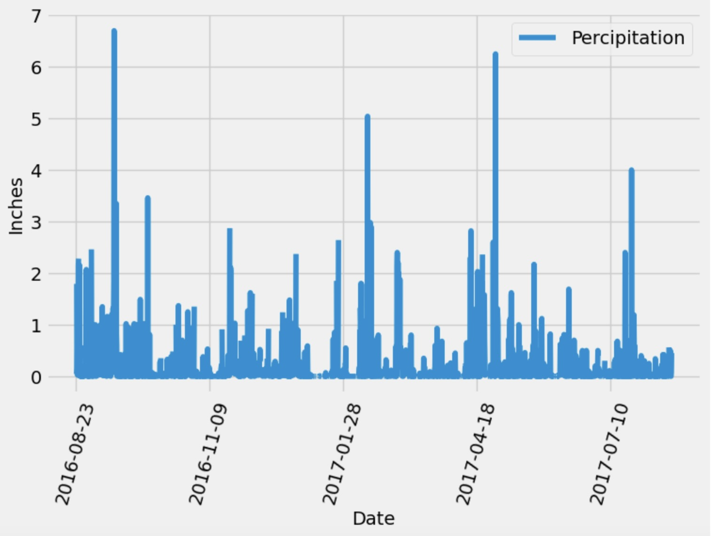

# sqlalchemy-challenge

This project consists of two parts:

### Part 1: Analyze and Explore the Climate Data by doing precipitation analysis and station analysis
 
 #### Precipitation Analysis:
 
In this section, i used Python and SQLAlchemy to do a basic climate analysis and data exploration of my climate database. Specifically, i used SQLAlchemy ORM queries, Pandas, and Matplotlib. To do so, i completed the following steps:
 
- Find the most recent date in the dataset.
- Use that date to get the previous 12 months of precipitation data by querying the previous 12 months of data.
- Select only the "date" and "prcp" values.
- Load the query results into a Pandas DataFrame. Explicitly set the column names.
- Sort the DataFrame values by "date".
- Plot the results by using the DataFrame plot method, as the following image shows:

- Use Pandas to print the summary statistics for the precipitation data. 
 
 #### Station Analysis:
 
In this section, i completed the following steps:
 
- Design a query to calculate the total number of stations in the dataset. 
- Design a query to find the most-active stations (that is, the stations that have the most rows). 
- Design a query that calculates the lowest, highest, and average temperatures that filters on the most-active station id found in the previous query.
- Design a query to get the previous 12 months of temperature observation (TOBS) data, as the following image shows:

### Part 2: Design a Climate App

In this section, i designed a Flask API based on the queries that were just developed. To do so, i used Flask to create my routes as follows:
- Start at the homepage, and list all the available routes.
- Convert the query results from my precipitation analysis to a dictionary using date as the key and prcp as the value, and return the JSON representation of my dictionary.
- Return a JSON list of stations from the dataset.
- Query the dates and temperature observations of the most-active station for the previous year of data, and return a JSON list of temperature observations for the previous year.
- Return a JSON list of the minimum temperature, the average temperature, and the maximum temperature for a specified start or start-end range.
    - For a specified start, calculate TMIN, TAVG, and TMAX for all the dates greater than or equal to the start date.
    - For a specified start date and end date, calculate TMIN, TAVG, and TMAX for the dates from the start date to the end date, inclusive.

